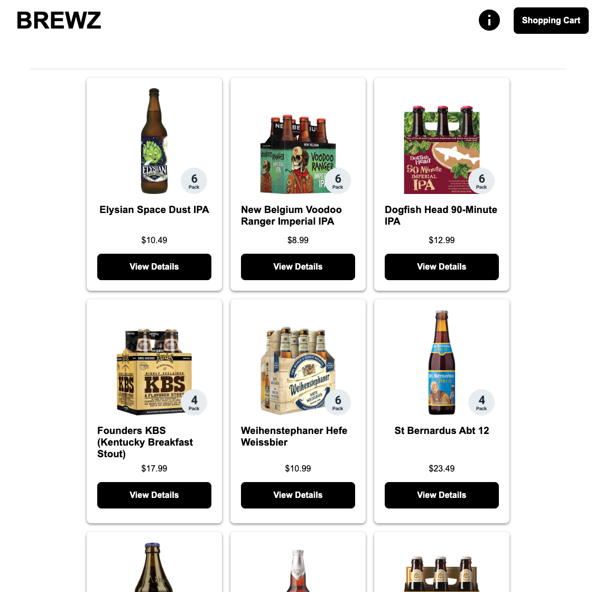

# Single-Page Application Demo

Aggregate test coverage for all components in this repo: [](https://coveralls.io/github/f5devcentral/spa-demo-app?branch=main)

This application demos a modern single-page application built on:

- Vue.js (front-end)
- Node.js (back-end)
- MongoDB (database)

This application was created to help train people on [NGINX](https://www.nginx.com/) and the [F5 Distributed Cloud Services](https://www.f5.com/cloud) capabilities. It is featured in the [Modern Apps Jumpstart Workshop](https://github.com/f5devcentral/modern_app_jumpstart_workshop).



## Components

### Frontend

Vue.JS application written in TypeScript that simulates a shopping cart application.

- Environment: Internet facing

### API

Node.JS application running on Express.JS that provides the primary API and access to the database.

- Environment: Internet facing

### Database

MongoDB database that stores information about the user and the products.  This database is seeded with user and product data on launch.

- Environment: Internal

### Recommendations

Node.JS microservice that will recommend products.

- Environment: Internet facing

### Inventory

Node.JS microservice that will tell the local store inventory.  Note, this microservice is accessed through the API and simulates the API server talking to an internal service.

- Environment: Internal, accessibly by the API server

### Checkout

Node.JS microservice that will complete the ordering process.

- Environment: Internet facing

## Features

### Product Detail

The Product detail page contains the recommendations and inventory microservices.


## Deploy

```bash
docker-compose up -d
```

## Development

### back-end services (api, inventory, recommendations)

#### Running

```bash
cd <service folder here>
export MONGO_URL="localhost"
export INVENTORY_URL="http://localhost:8002"
export RECOMMENDATIONS_URL="http://recommendations:8001"
npm dev
```

Optionally, to run the dark variant of the Brewz SPA app: `npm run dev-dark`.

#### Unit Tests

```bash
cd <service folder here>
npm run test:unit
```

#### Code Coverage Metrics

```bash
cd <service folder here>
npm run test:coverage
```

Coverage reports will appear in each subproject's `coverage` directory.

### spa (front-end)

```bash
cd spa
npm run serve
```

You will also need to update the *./spa/.env* with the correct API server URL.

### Docker Compose

You can use the docker-compose file leveraged in production for development as well.

```bash
docker-compose up -d
```

To stop the container you want to do development on and run it locally:

```bash
docker-compose rm -sv container-name
```

Then start your front-end or back-end as shown above.

## Attribution

This code is based on the work of [Shaun Wassell](https://www.linkedin.com/in/shaun-wassell?trk=lil_course&lipi=urn%3Ali%3Apage%3Ad_learning_content%3BEJRJvvk4SzmhYz%2Bf1ZJBUw%3D%3D&licu=urn%3Ali%3Acontrol%3Ad_learning_content-view_on_linkedin) and his [Creating and Hosting a Full-Stack Site LinkedIn Learning course](https://www.linkedin.com/learning/vue-js-creating-and-hosting-a-full-stack-site/).

I have extended this demo to:

- run components in docker containers
- abstract API and image URLs
- seed MongoDB
- recommendations microservice
- checkout (ordering) microservice
- store inventory simulation  
- stats page for all services
- use OIDC and OAuth 2 for authentication/authorization to spa app and backend services via JWT
