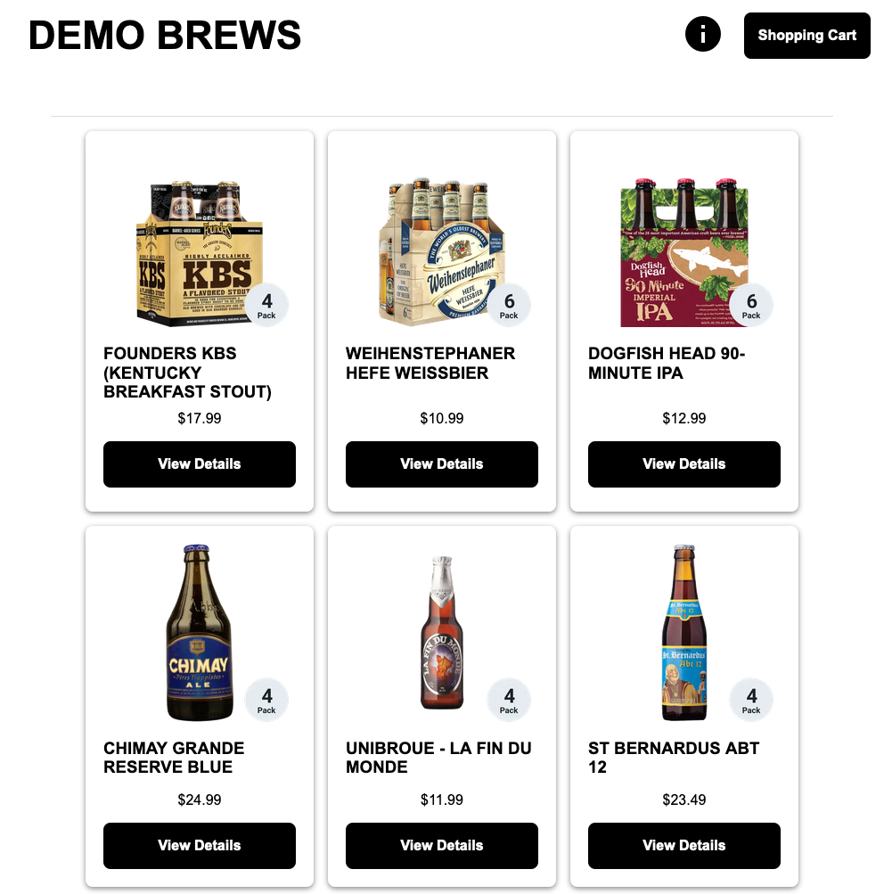

# Single-Page Application Demo 
This application demos a modern single-page application build on:
- Vue.js (front-end)
- Node.js (back-end)
- MongoDB (database)



# Components
### Frontend
Vue.JS application that simulates a shopping cart application.

### API
Node.JS application running on Express.JS that provides the primary API and access to the database. 

### Database
MongoDB database that stores information about the user and the products.  This database is seeded with user and product data on launch. 

### Recommendations
Node.JS microservice that will recommend products.

# Deploy 
```bash
docker-compose up -d
```

# Development 
## back-end
```bash
cd back-end
export MONGO_URL="http://localhost:8000"
export INVENTORY_URL="http://localhost:8002"
npm run dev
```

## front-end
```bash
cd front-end
npm run serve
```

You will also need to update the *./front-end/.env* with the correct API server URL.

## Docker Compose
You can use the docker-compose file leveraged in production for development as well.
```bash
docker-compose up -d
```

To stop the container you want to do development on and run it locally:
```bash
docker-compose rm -sv container-name
```

Then start your front-end or back-end as shown above. 

# Attribution
This code is based on the work of [Shaun Wassell](https://www.linkedin.com/in/shaun-wassell?trk=lil_course&lipi=urn%3Ali%3Apage%3Ad_learning_content%3BEJRJvvk4SzmhYz%2Bf1ZJBUw%3D%3D&licu=urn%3Ali%3Acontrol%3Ad_learning_content-view_on_linkedin) and his [Creating and Hosting a Full-Stack Site LinkedIn Learning course](https://www.linkedin.com/learning/vue-js-creating-and-hosting-a-full-stack-site/).

I have extended his demo to:
- run components in docker containers
- abstract API and image URLs 
- seed MongoDB 
- recommendations microservice 
- stats page for all services