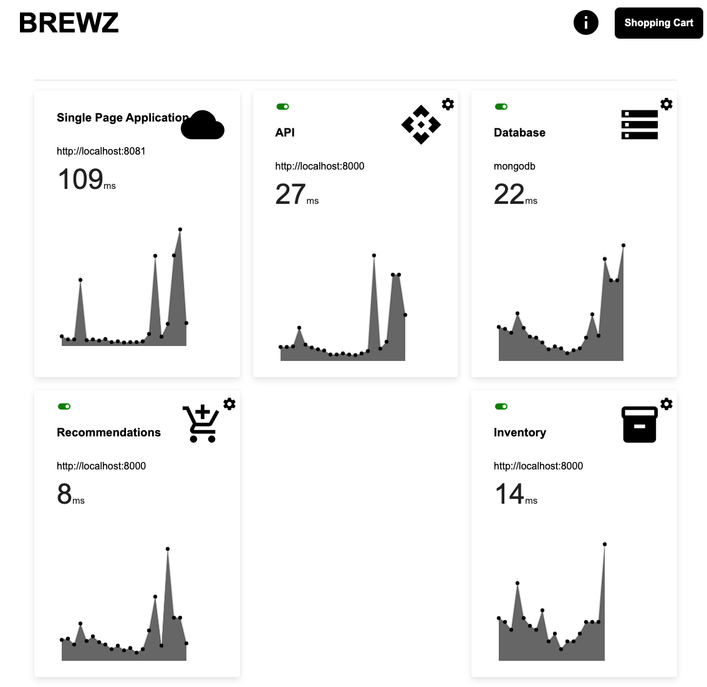

# Single-Page Application Demo 
This application demos a modern single-page application built on:
- Vue.js (front-end)
- Node.js (back-end)
- MongoDB (database)

This application was created to help train people on the [F5 Distributed Cloud Services](https://www.f5.com/cloud) capabilities. 


# Components
### Frontend
Vue.JS application that simulates a shopping cart application.

- Environment: Internet facing 

### API
Node.JS application running on Express.JS that provides the primary API and access to the database. 

- Environment: Internet facing

### Database
MongoDB database that stores information about the user and the products.  This database is seeded with user and product data on launch. 

- Environment: Internal 

### Recommendations
Node.JS microservice that will recommend products.

- Environment: Internet facing 

### Inventory
Node.JS microservice that will tell the local store inventory.  Note, this microservice is accessed through the API and simulates the API server talking to an internal service. 

- Environment: Internal, accessibly by the API server

# Features
### Stats Page
The stats page provides information for the various components that make up this application:
- service URL
- Latency
- Historic latency graph

If a component is offline, the component card will go red as pictured below.



### Product Detail
The Product detail page contains the recommendations and inventory microservices. 


# Deploy 
```bash
docker-compose up -d
```

# Development 
## back-end services (api, inventory, recommendations)
```bash
cd <service folder here>
export MONGO_URL="localhost"
export INVENTORY_URL="http://localhost:8002"
npm run dev
```

## spa (front-end)
```bash
cd spa
npm run serve
```

You will also need to update the *./spa/.env* with the correct API server URL.

## Docker Compose
You can use the docker-compose file leveraged in production for development as well.
```bash
docker-compose up -d
```

To stop the container you want to do development on and run it locally:
```bash
docker-compose rm -sv container-name
```

Then start your front-end or back-end as shown above. 

# Attribution
This code is based on the work of [Shaun Wassell](https://www.linkedin.com/in/shaun-wassell?trk=lil_course&lipi=urn%3Ali%3Apage%3Ad_learning_content%3BEJRJvvk4SzmhYz%2Bf1ZJBUw%3D%3D&licu=urn%3Ali%3Acontrol%3Ad_learning_content-view_on_linkedin) and his [Creating and Hosting a Full-Stack Site LinkedIn Learning course](https://www.linkedin.com/learning/vue-js-creating-and-hosting-a-full-stack-site/).

I have extended his demo to:
- run components in docker containers
- abstract API and image URLs 
- seed MongoDB 
- recommendations microservice
- store inventory simulation  
- stats page for all services